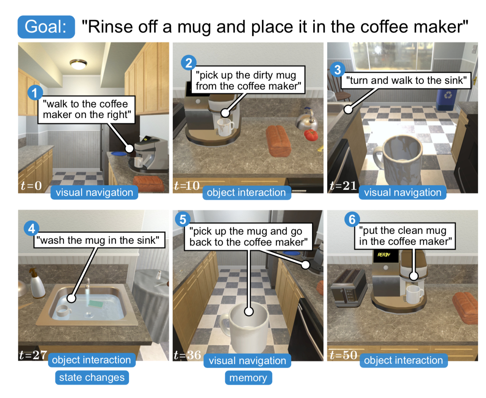

# ALFRED

[<b>A Benchmark for Interpreting Grounded Instructions for Everyday Tasks</b>](https://arxiv.org/abs/1912.01734)  
[Mohit Shridhar](https://mohitshridhar.com/), [Jesse Thomason](https://jessethomason.com/), [Daniel Gordon](https://homes.cs.washington.edu/~xkcd/), [Yonatan Bisk](https://yonatanbisk.com/),  
[Winson Han](https://allenai.org/team.html), [Roozbeh Mottaghi](http://roozbehm.info/), [Luke Zettlemoyer](https://www.cs.washington.edu/people/faculty/lsz), [Dieter Fox](https://homes.cs.washington.edu/~fox/)  
[CVPR 2020](http://cvpr2020.thecvf.com/)

**ALFRED** (**A**ction **L**earning **F**rom **R**ealistic **E**nvironments and **D**irectives), is a new benchmark for learning a mapping from natural language instructions and egocentric vision to sequences of actions for household tasks. Long composition rollouts with non-reversible state changes are among the phenomena we include to shrink the gap between research benchmarks and real-world applications.

For the latest updates, see: [**askforalfred.com**](https://askforalfred.com)



## Quickstart

Clone repo:
```bash
$ git clone https://github.com/askforalfred/alfred.git alfred
$ export ALFRED_ROOT=$(pwd)/alfred
```

Install requirements:
```bash
$ virtualenv -p $(which python3) --system-site-packages alfred_env # or whichever package manager you prefer
$ source alfred_env/bin/activate

$ cd $ALFRED_ROOT
$ pip install --upgrade pip
$ pip install -r requirements.txt
```

Download Trajectory JSONs and Resnet feats (~198GB):
```bash
$ cd $ALFRED_ROOT/data
$ sh download_data.sh json_feat
```

Train models:
```bash
$ cd $ALFRED_ROOT
$ python models/train/train_seq2seq.py --data data/json_feat_2.1.0 --model seq2seq_im_mask --dout exp/model:{model},name:pm_and_subgoals_01 --splits data/splits/oct21.json --gpu --batch 8 --pm_aux_loss_wt 0.2 --subgoal_aux_loss_wt 0.2
```

## More Info 

- [**Dataset**](data/): Downloading full dataset, Folder structure, JSON structure.
- [**Models**](models/): Training and Evaluation, File structure, Pre-trained models.
- [**Data Generation**](gen/): Generation, Replay Checks, Data Augmentation (high-res, depth, segementation masks etc).

## Prerequisites

- Python 3
- PyTorch 1.1.0
- Torchvision 1.3.0
- AI2THOR 2.1.0

See [requirements.txt](requirements.txt) for all prerequisites

## Leaderboard

Run your model on test seen and unseen sets, and create an action-sequence dump of your agent:

```bash
$ cd $ALFRED_ROOT
$ python models/eval/leaderboard.py --model_path <model_path>/model.pth --model models.model.seq2seq_im_mask --data data/json_feat_2.1.0 --gpu --num_threads 5
```

This will create a JSON file, e.g. `task_results_20191218_081448_662435.json`, inside the `<model_path>` folder. Submit this JSON here: [AI2 ALFRED Leaderboard](https://leaderboard.allenai.org/alfred/submissions/public). For rules and restrictions, see the [getting started page](https://leaderboard.allenai.org/alfred/submissions/get-started).

## Docker Setup

Coming soon ...

## Cloud Instance

See [this article](https://medium.com/@etendue2013/how-to-run-ai2-thor-simulation-fast-with-google-cloud-platform-gcp-c9fcde213a4a) for setting-up THOR on cloud-instances.

## Citation

If you find the dataset or code useful, please cite:

```
@inproceedings{ALFRED20,
  title ={{ALFRED: A Benchmark for Interpreting Grounded
           Instructions for Everyday Tasks}},
  author={Mohit Shridhar and Jesse Thomason and Daniel Gordon and Yonatan Bisk and
          Winson Han and Roozbeh Mottaghi and Luke Zettlemoyer and Dieter Fox},
  booktitle = {The IEEE Conference on Computer Vision and Pattern Recognition (CVPR)},
  year = {2020},
  url  = {https://arxiv.org/abs/1912.01734}
}
```

## License

MIT License

## Contact

Questions or issues? Contact [askforalfred@googlegroups.com](askforalfred@googlegroups.com)
