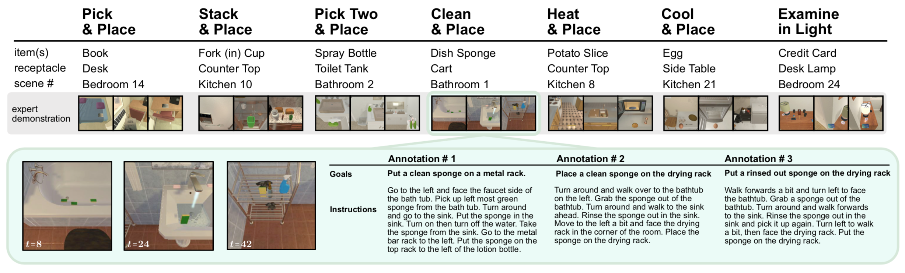

# Dataset

The ALFRED dataset contains 8k+ expert demostrations with 3 or more language annotations each. A trajectory consists of a sequence of expert actions, the corresponding image observations, and language annotations describing segments of the trajectory.



## Download

We provide a download script with three options:

**1.** [Lite](https://ai2-vision-alfred.s3-us-west-2.amazonaws.com/json_2.1.0.7z) (35MB): Trajectory JSONs. Images need to be generated with [augment_trajectories.py](../gen/README.md#data-augmentation) and Resnet feats with [extract_resnet.py](../data#extracting-resnet-features):

```bash
$ cd $ALFRED_ROOT/data
$ sh download_data.sh json
```

**2.** [Modeling Quickstart](https://ai2-vision-alfred.s3-us-west-2.amazonaws.com/json_feat_2.1.0.7z) (~17GB) - **Recommended**: Trajectory JSONs and Resnet Features
```bash
$ sh download_data.sh json_feat
```

**3.** [Full Dataset](https://ai2-vision-alfred.s3-us-west-2.amazonaws.com/full_2.1.0.7z) (~109GB) - Trajectory JSONs, Raw Images, PDDL States, Videos, Full Resnet Features

```bash
$ sh download_data.sh full
```

Alternatively, if prefer to use something other than `wget`, you can directly use the download links in [download_data.sh](download_data.sh).  

**Note**: You need double the amount of storage space while unzipping the files.

## File Structure

```
data/train/task_type-object-movableReceptacle-receptacle-sceneNum/trial_ID/                  (trajectory root)
data/train/task_type-object-movableReceptacle-receptacle-sceneNum/trial_ID/traj_data.json    (trajectory metadata)
data/train/task_type-object-movableReceptacle-receptacle-sceneNum/trial_ID/feat_conv.pt      (Resnet18 features)
data/train/task_type-object-movableReceptacle-receptacle-sceneNum/trial_ID/problem_x.pddl    (pddl state)
data/train/task_type-object-movableReceptacle-receptacle-sceneNum/trial_ID/video.mp4         (video sequence)
data/train/task_type-object-movableReceptacle-receptacle-sceneNum/trial_ID/raw_images/       (images from trajectory)
```

## JSON Structure

Dictionary sturcture of `traj_data.json`:

Task Info:
```
['task_id'] = "trial_00003_T20190312_234237"        (unique trajectory ID)
['task_type'] = "pick_heat_then_place_in_recep"     (one of 7 task types)
['pddl_params'] = {'object_target': "AlarmClock",   (object)
                   'parent_target': "DeskLamp",     (receptacle)
                   'mrecep_target': "",             (movable receptacle)
                   "toggle_target": "",             (toggle object)
                   "object_sliced": false}          (should the object be sliced?)
```

Scene Info:
```
['scene'] =  {'floor_plan': "FloorPlan7",           (THOR scene name)
              'scene_num' : 7,                      (THOR scene number)
              'random_seed': 3810970210,            (seed for initializing object placements)
              'init_action' : <API_CMD>,            (called to set the starting position of the agent)
              'object_poses': <LIST_OBJS>,          (initial 6DOF poses of objects in the scene)
              'object_toggles': <LIST_OBJS>}        (initial states of togglable objects)
```

Language Annotations:
```
['turk_annotations']['anns'] =  
             [{'task_desc': "Examine a clock using the light of a lamp.",                 (goal instruction) 
               'high_descs': ["Turn to the left and move forward to the window ledge.",   (list of step-by-step instructions)
                              "Pick up the alarm clock on the table", ...],               (indexes aligned with high_idx)
               'votes': [1, 1, 1]                                                         (AMTurk languauge quality votes)
              },
              ...]
```

Expert Demonstration:
```
['plan'] = {'high_pddl':
                ...,
                ["high_idx": 4,                          (high-level subgoal index)
                 "discrete_action":                    
                     {"action": "PutObject",             (discrete high-level action)
                      "args": ["bread", "microwave"],    (discrete params)
                 "planner_action": <PDDL_ACTION> ],      (PDDL action)
                ...],
                 
            'low_actions': 
                ...,
                ["high_idx": 1,                          (high-level subgoal index)
                 "discrete_action":
                     {"action": "PickupObject",          (discrete low-level action)
                      "args": 
                          {"bbox": [180, 346, 332, 421]} (bounding box for interact action)
                           "mask": [0, 0, ... 1, 1]},    (compressed pixel mask for interact action)
                 "api_action": <API_CMD> ],              (THOR API command for replay)
                ...], 
           }
```

Images:
```
['images'] = [{"low_idx": 0,                    (low-level action index)
               "high_idx": 0,                   (high-level action index)
               "image_name": "000000000.jpg"}   (image filename)
             ...]
```

**Note**: The [Full Dataset](https://ai2-vision-alfred.s3-us-west-2.amazonaws.com/full_2.1.0.7z) contains extracted Resnet features for each frame in `['images']
`, whereas [Modeling Quickstart](https://ai2-vision-alfred.s3-us-west-2.amazonaws.com/json_feat_2.1.0.7z) only contains features for each `low_idx`. The indexes of `['turk_annotations']['anns']['high_descs']` are aligned with `high_idx`.  

Use `--use_templated_goals` with [train_seq2seq.py](../models/train/train_seq2seq.py) to use templated goals instead of human-annotated goal descriptions. 

## Extracting Resnet Features

To extract Resnet features from raw image sequences:

```bash
$ python models/utils/extract_resnet.py --data data/full_2.1.0 --batch 32 --gpu --visual_model resnet18 --filename feat_conv.pt
```

This will save `feat_conv.pt` files insides each trajectory root folder.  

**Note**: Data generator saved PNG files, which were later converted into JPGs. 
