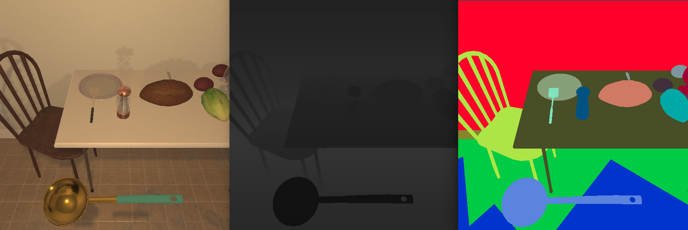

# Data Generation

We also provide code for generating PDDL-based expert demonstrations. This can be used to extend the training data, albiet without human language annotations.  

## Installation

Get dependencies and compile the planner:
```bash
$ sudo apt-get install ffmpeg flex bison

$ cd $ALFRED_ROOT/gen/ff_planner
$ make
```

## Generation

To spawn multiple generation threads:

```bash
$ cd $ALFRED_ROOT/gen
$ python scripts/generate_trajectories.py --save_path data/new_trajs --in_parallel --debug --num_threads 2 
```

This will sample tasks based on the sampling mechanism described in the paper. 


## Replay Checks

```bash
$ python scripts/replay_checks.py --data_path data/new_trajs --in_parallel  
```

## Data Augmentation

```bash
python scripts/augment_trajectories.py --data_path data/json_2.1.0 --num_threads 2 --smooth_nav --time_delays
```




## PDDL Goals

The goals for the planner are specified in [goal_library.py](goal_library.py). Here is a simple pick-and-place PDDL goal definition:

```
# basic pick and place (e.g: "put the apple in the microwave")
gdict["pick_and_place_simple"] = '''
    (:goal
        (and
            ;; make sure all the cabinets and doors are closed in the end
            (forall (?re # receptacle)
                (not (opened ?re))
            )
            
            ;; make sure some object {obj} exists inside some receptacle {recep}
            (exists (?r # receptacle)
                (exists (?o # object)
                    (and 
                        (inReceptacle ?o ?r) 
                        (objectType ?o {obj}Type) 
                        (receptacleType ?r {recep}Type)
                    )
                )
            )
        )
    )
)
'''
```