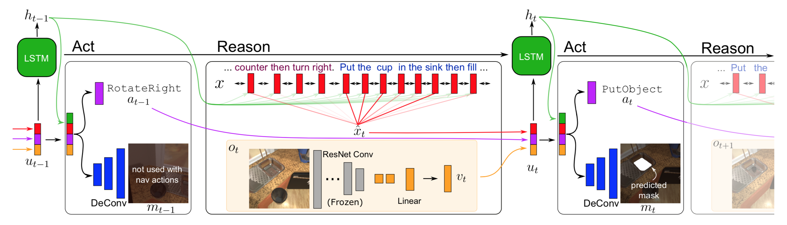

# Models

We provide PyTorch code and pre-trained models for the baseline seq2seq models described in the paper.



## Training

Following the [quickstart](../README.md) installation, to start training seq2seq models:

```bash
$ cd $ALFRED_ROOT
$ python models/train/train_seq2seq.py --data data/json_feat_2.1.0 --model seq2seq_im_mask --dout exp/model:{model},name:pm_and_subgoals_01 --splits data/splits/oct21.json --gpu --batch 8 --pm_aux_loss_wt 0.1 --subgoal_aux_loss_wt 0.1 --preprocess
```

Run this **once with** `--preprocess` to save preprocessed JSONs inside the trajectory folders. This could take a few minutes, but subsequent runs can be deployed without any preprocessing. See [train_seq2seq.py](train/train_seq2seq.py) for hyper-parameters and other settings. 

Use `tensorboard --logdir exp --port 6006` to visualize losses and performance metrics.

## Evaluation

### Task Evaluation

To evaluate a trained model through real-time execution on THOR:

```bash
$ python models/eval/eval_seq2seq.py --model_path <model_path>/best_seen.pth --eval_split valid_seen --data data/json_feat_2.1.0 --model models.model.seq2seq_im_mask --gpu --num_threads 3
```

Use `eval_split` to specify which split to evaluate, and `num_threads` to indicate the number of parallel evaluation threads to spawn. The experiments in the paper used `max_fails=10` and `max_steps=1000`. The results will be dumped as a JSON file `task_results_<timestamp>.json` inside the `model_path` directory. 

**Note:** If you are training and evaluating on different machines or if you just downloaded a checkpoint, you need to run eval with `--preprocess` once with the appropriate dataset path. Also, after a fresh-install, run with `--num_threads 1` to allow the script to download the THOR binary.


### Subgoal Evaluation

To evaluate individual subgoals for each task, run with `--subgoal`:

```bash
$ python models/eval/eval_seq2seq.py --model_path <model_path>/best_seen.pth --eval_split valid_seen --data data/json_feat_2.1.0 --model models.model.seq2seq_im_mask --gpu --num_threads 3 --subgoals all
```
This will use the expert demonstrations to reach the subgoal to be evaluated. You can specify `--subgoals all` to evaluate all subgoals, or select specific ones e.g `--subgoal GoalLocation,HeatObject`. Possible subgoals include `GotoLocation`, `PickupObject`, `PutObject`, `CleanObject`, `HeatObject`, `CoolObject`, `ToggleObject`, `SliceObject`. The results will be dumped as a JSON file `subgoal_results_<timestamp>.json` inside the `model_path` directory.


### Leaderboard

Run your model on test seen and unseen sets, and create an action-sequence dump of your agent:

```bash
$ cd $ALFRED_ROOT
$ python models/eval/leaderboard.py --model_path <model_path>/best_seen.pth --model models.model.seq2seq_im_mask --data data/json_feat_2.1.0 --gpu --num_threads 5
```

This will create a JSON file, e.g. `task_results_20191218_081448_662435.json`, inside the `<model_path>` folder. Submit this JSON here: [AI2 ALFRED Leaderboard](https://leaderboard.allenai.org/alfred/submissions/public).  

The JSON contains deterministic THOR API commmands executed by your trained agent, which will be replayed on the leaderboard server for evaluation. This process is model-agnostic, allowing you to use your local resources for test-time inference. For restrictions and guidelines regarding the submission, see the [getting started page](https://leaderboard.allenai.org/alfred/submissions/get-started).

## File Structure

```
/model
    seq2seq.py           (base module with train and val loops)
    seq2seq_im_mask.py   (full model with batching and losses)
/nn
    vnn.py               (encoder, decoder, attention mechanisms)
    resnet.py            (pre-trained Resnet feature extractor)
/train
    train_seq2seq.py     (main with training args)
/eval
    eval_seq2seq.py      (main with eval args)
    eval_subgoals.py     (subgoal eval)
    eval_task.py         (overall task eval)
/config
    rewards.json         (reward values for actions; not used)
```

## Pre-trained Model

Download the [Seq2Seq+PM (both)](https://ai2-vision-alfred.s3-us-west-2.amazonaws.com/seq2seq_pm_chkpt.zip) model checkpoint:

```bash
$ wget https://ai2-vision-alfred.s3-us-west-2.amazonaws.com/seq2seq_pm_chkpt.zip
$ unzip seq2seq_pm_chkpt.zip
```

The unzipped folder should contain `best_seen.pth` and `best_unseen.pth` checkpoints.  

**Note**: Some users have reported that they had to train the model themselves to reproduce the results. If the results from the pre-trained model are dramatically worse than the ones reported in the paper, you could try training the model from scratch. We are looking into the source of this issue.
